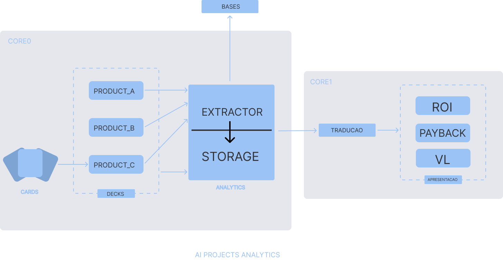

# [RFC] Architectural Blueprint: Products Analytics
**Author:** Gabriel Chaves  
**Date:** September 2026  
**Status:** In-Investigation (Phase 1-3)

---

## Abstract
This project establishes a robust computational framework to evaluate the financial and operational return of engineering initiatives, with a primary focus on Artificial Intelligence (AI) implementations, utilizing standardized metrics such as Return on Investment (ROI), Payback Period, and Liquidity Value (LV). The system is designed to evolve iteratively through a strictly decoupled, modular architecture grounded in state-of-the-art methodologies and academic references. Rather than treating evaluation as an isolated computation, this solution positions data integrity and centralized monitoring as core requirements for objective value assessment.

---

## 1. Introduction & Contextualization
*   **Problem Statement:** The project originated as a demand for a standalone ROI calculation mechanism for an active AI squad. However, initial investigation revealed an absence of verified operational data and standard metrics. Consequently, the architecture evolved into a foundational Analytics and Data Centralization framework. The core challenge shifts from formula execution to data engineering: designing a centralized pipeline to aggregate dispersed pipeline behaviors, enabling empirical, data-driven value generation.
*   **Target Stakeholders:** 
    *   *AI Engineering Squad:* Establishes an empirical baseline to justify, scope, and prioritize new project requests, replacing intuition with quantifiable historical metrics.
    *   *Finance & Executive Leadership:* Gains access to an audited financial reporting layer detailing the exact yield, cost efficiency, and net return of specialized technology assets.
*   **Deliverable Boundary:** The scope of this system is constrained to two explicit deliverables:
    *   *Strategic Dashboard:* A centralized visualization layer rendering high-level evaluation metrics (ROI, Payback, LV).
    *   *Synthesized Analytics Core:* A deterministic data matrix (tabular view) aggregating performance KPIs across all active software components.
    *   *Out of Scope:* This project does not prescribe business strategies, nor does it automate capital allocation decisions.

---

## 2. Priorities & Constraints Matrix (Ranked)
List what actually matters for this architectural decision in order of importance. 
1. **[Priority 1, e.g., Statistical Rigor]:** Why it matters under an academic/investigative perspective.
2. **[Priority 2, e.g., Cost / Computational Overhead]:** The real-world production ceiling.
3. **[Priority 3, e.g., Automation Velocity]:** How easily this block can be automated by the factory.

---

## 3. Problem Formulation & Theoretical Foundations
*   **Mathematical Modeling:** Formalize the logic of the problem using equations, functions, or topological graphs.
    
    $$System = f(X, W) = \dots$$

*   **State-of-the-Art & Industry Benchmarks:** List the academic papers, whitepapers, or industry methodologies that back up your architectural choice.
    *   *Reference [1]:* [Title/Link of Paper] - Key takeaway applied here.
    *   *Reference [2]:* [Title/Link of Paper] - Key takeaway applied here.

---

## 4. Hypotheses & Discovery Lanes (The Investigation)
This is where your research mind acts as a barrier against bad code. Question the assumptions before building.

### 4.1 Core Hypotheses & Trade-offs
*   **Hypothesis 01 [Dependency]:** (e.g., "The ROI cannot be calculated directly without a prior analytics layer.")
*   **Hypothesis 02 [Constraint]:** (e.g., "Deterministic logic loops must replace probabilistic models to avoid financial variance.")

### 4.2 Variables & Constraints Matrix
*   **Known Inputs:** What data features are readily available and verified?
*   **Latent Variables / Risks:** What variables are hidden, unmapped, or highly volatile?

### 4.3 Proposed Approaches & Baselines
*   **Option A [Proposed Modular System]:** Describe your planned architecture.
    *   *Pros/Cons:* Focus on the trade-offs regarding your ranked priorities.
*   **Option B [Do Nothing / Baseline]:** What happens if we use a primitive heuristic (e.g., standard Excel/rule-based system) instead of building this software?

---

## 5. Agnostic Modular Architecture (The Blueprint)
The system is bifurcated into two independent architectural cores, enforcing strict separation between the data engineering ingestion layer and the downstream financial evaluation engine.

  

*   **Core 0 [Analytics & Ingestion Engine]:**
    *   *Input:* Cards consisting of localized operational questionnaire parameters mapping pre/post-deployment states.
    *   *Process:* The pipeline instantiates target collection vectors (Decks) assigned to isolated entities (Product_A, Product_B, Product_C). A centralized operational unit (Extractor) pulls records from native repositories and formats data into a unified, immutable storage layer (Storage), updating downstream historical relational tables (Bases).
    *   *Output:* A normalized, queryable schema capturing components' cost and performance metrics.
*   **Core 1 [Extraction / Retrieval]:**
    *   *Input:* Normalized historical outputs extracted from Core 0 Storage.
    *   *Process:* Employs a deterministic translation layer (Tradução) to map performance attributes (e.g., hours saved, server computational reduction) into direct monetary metrics. This data is routed through financial formulation algorithms to compute specific yield parameters.
    *   *Output:* A synchronized presentation matrix (Apresentação) rendering empirical variables: Return on Investment (ROI), Payback Period (Payback), and Liquidity Value (VL).
---

## 6. Evaluation & Validation Framework
To evaluate this architecture before final production automation, a Proof of Concept (PoC) must be executed utilizing deterministic mock data arrays matching the Core 0 structural schemas.

### 6.1 PoC Validation Goals
*   Verify the data contract boundaries between the Extractor interface and the Storage layer.
*   Validate if the Tradução module maps non-monetary variables to financial indicators accurately without floating-point errors.
*  Ensure that changing values in a single mock Product deck updates the downstream Apresentação matrix correctly.